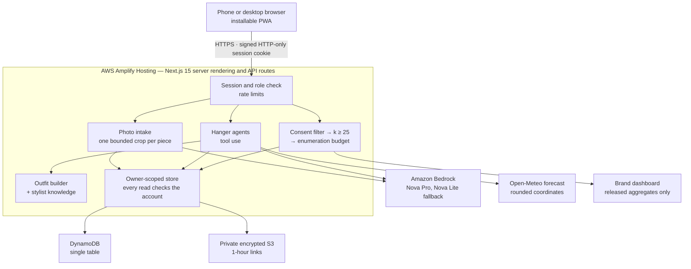

# Racked — Privacy-First Wardrobe Intelligence for Consumers and Brands

[](https://github.com/manof1color/racked-wardrobe-intelligence/actions/workflows/ci.yml)
[](https://github.com/manof1color/racked-wardrobe-intelligence/actions/workflows/codeql.yml)

**Brands know what consumers buy. Racked shows them what consumers actually wear — without ever seeing anyone's closet.**

People get a wardrobe and an AI stylist that are useful on their own. Brands get consented, minimum-cohort intelligence about how their products are really worn — never names, photos, or wardrobes.

| | |
| --- | --- |
| **Live application** | https://main.d2iv0khybuuaeh.amplifyapp.com — installable on a phone |
| **What is deployed right now** | [`/api/version`](https://main.d2iv0khybuuaeh.amplifyapp.com/api/version) returns the exact commit Amplify built |
| **Demo accounts** | [Demo access](#demo-access) — passwords are in the submission packet, never in this public repository |
| **Stack** | Next.js 15 · React 19 · TypeScript · AWS Amplify (SSR) · DynamoDB · private S3 · Amazon Bedrock (Nova Pro, Nova Lite) · Open-Meteo · GitHub Actions · CodeQL |
| **Built for** | CUA Busch School AI Vibe Coding Contest, Fall 2026 |

---

## Judge Scorecard

Every scoring category, what Racked does for it, and where to check it yourself. Each link goes to the live app, the code, a test, or a document.

| Category | Weight | What to look for | Verify it |
| --- | ---: | --- | --- |
| **Problem & relevance** | 20% | Purchase data stops at checkout. Racked measures what is actually worn — consented, and released only above 25 owners. Synthetic hero product: **76 wears · 25 owners · 88% engagement · 76% repeat use** | [What this is](#what-this-is) · [Proof point](#competition-proof-point) · [One-page summary](docs/one-page-summary.md) |
| **Functionality** | 25% | Live AWS app with real accounts: photo → wardrobe, Looks builder, Hanger stylist, outfits and wear tracking, Community and Recreate, brand enrollment, and a `k ≥ 25` brand dashboard | [Live app](https://main.d2iv0khybuuaeh.amplifyapp.com) · [Five-minute path](#five-minute-judge-path) · [Feature highlights](#feature-highlights) · [Judge accounts](docs/judge-accounts.md) |
| **AI integration & innovation** | 20% | Nova Pro finds every garment in a photo; Hanger is a **tool-using agent** that searches the wardrobe, builds outfits, checks the forecast, and reads trends; a written **stylist knowledge dataset** with its own evaluation set; Brand Hanger sees only privacy-released aggregates | [How AI is used](#how-ai-is-used) · [`hanger-agent.ts`](lib/hanger-agent.ts) · [`garment-knowledge.ts`](lib/garment-knowledge.ts) · [Stylist evaluation](tests/stylist-eval.test.ts) · [AI use log](docs/ai-use-log.md) |
| **Code, docs & GitHub** | 15% | **646 tests** in 91 files; every PR passes audit, lint, type check, tests, build, and CodeQL before merge; 145+ merged PRs; a 71-phase build log | [CI runs](https://github.com/manof1color/racked-wardrobe-intelligence/actions/workflows/ci.yml) · [Testing](#testing-and-ci) · [Repository map](#repository-map) · [PROGRESS.md](PROGRESS.md) · [Merged PRs](https://github.com/manof1color/racked-wardrobe-intelligence/pulls?q=is%3Apr+is%3Amerged) |
| **UX & polish** | 10% | Mobile-first installable app, bottom tabs, a swipe-through Looks builder, whole-piece garment previews, and honest empty and suppressed states | [Open it on a phone](https://main.d2iv0khybuuaeh.amplifyapp.com) · [Looks builder](components/looks-builder.tsx) · [Brand UX review](docs/brand-ux-review.md) |
| **Business impact** | 10% | Consumers free; brands pay for intelligence they cannot get elsewhere; a Starter tier for brands still below the threshold | [Business model](#business-model--pricing-proposed--not-currently-billed) · [Pricing page](https://main.d2iv0khybuuaeh.amplifyapp.com/pricing) · [Proof point](#competition-proof-point) |
| **Bonus** | — | Explicit consent, `k ≥ 25` plus an enumeration budget, private encrypted storage, rate limits, owner-scoped deletion | [Privacy boundaries](#security-and-privacy-boundaries) · [`privacy.ts`](lib/privacy.ts) · [Privacy and ethics](docs/privacy-and-ethics.md) |

A per-criterion evidence checklist is in [docs/competition-checklist.md](docs/competition-checklist.md).

### Find it fast

| Question | Answer |
| --- | --- |
| How do I sign in as a judge? | [Demo access](#demo-access) and the [three-minute tour](docs/judge-accounts.md) |
| Where does the AI run, and on which model? | [How AI is used](#how-ai-is-used) — the table names the engine behind every decision |
| How does Hanger choose what to wear? | [`lib/hanger-agent.ts`](lib/hanger-agent.ts) calls [`lib/outfit-ranking.ts`](lib/outfit-ranking.ts), which ranks with [`lib/garment-knowledge.ts`](lib/garment-knowledge.ts) |
| Where is privacy enforced? | [`lib/privacy.ts`](lib/privacy.ts) (`k ≥ 25`, enumeration budget) and [`lib/server/production-store.ts`](lib/server/production-store.ts) (every read is owner-scoped) |
| Can a brand ever see someone's wardrobe? | No — [Security and privacy boundaries](#security-and-privacy-boundaries), tested in [`brand-route-guards`](tests/brand-route-guards.test.ts) and [`privacy`](tests/privacy.test.ts) |
| Do the tests pass? | [CI runs](https://github.com/manof1color/racked-wardrobe-intelligence/actions/workflows/ci.yml) — every merge is green — and [Testing and CI](#testing-and-ci) |
| How was it built? | [PROGRESS.md](PROGRESS.md), phase by phase, every merged PR linked |
| Which AI tools built it? | [docs/ai-use-log.md](docs/ai-use-log.md) |
| What does Racked *not* claim? | [Ethical stance and claims](#ethical-stance-and-claims) |

---

## Five-Minute Judge Path

**No sign-in needed (1 minute)**

1. Open [Community](https://main.d2iv0khybuuaeh.amplifyapp.com/community) — complete Consumer and Brand Looks, filterable by style, with each product's resolution state shown.
2. Open the [Judge Demo Atelier brand page](https://main.d2iv0khybuuaeh.amplifyapp.com/brands/judge-demo-atelier), then a [fictional storefront product](https://main.d2iv0khybuuaeh.amplifyapp.com/demo-store/racked-test-atelier/RTA-001): add it to the **Demo Bag** and complete the clearly labelled **$0.00 purchase simulation** — no payment, shipping, or contact data is collected.

**As the Judge Consumer (2 minutes)** — `judge.consumer@racked.local`

3. **Closet:** a **verified** brand piece and an owner's **pick** side by side, each with cost per wear. **Edit piece** changes any piece's details.
4. **Looks:** opens on Hanger's pick for today. Swipe a row to change a piece, lock a row and Shuffle the rest.
5. **Hanger** (the button at the bottom): try *"I need a more formal outfit"*, *"make me 3 outfits for the week"*, or *"which colours go with olive?"*. Outfits arrive as photo cards with Save and Record.
6. **Community → Recreate with my wardrobe:** how much of a public look this closet can already make, and what is missing.

**As the Judge Brand (2 minutes)** — `judge.brand@racked.local`

7. Open **Judge Signature Tee**: 50 opted-in owners, so metrics are released — an eight-week wear chart, repeat wear, pairings, and CSV export.
8. Open **Judge Limited Overshirt**: 4 owners, below `k ≥ 25`, so everything is suppressed — even the owner count — and the page says why. Ask **Brand Hanger** a strategy question.

**Optional:** sign in as `judge.newconsumer` and scan a real photo, or as `judge.newbrand` and enrol a product with **Fill in from photo**.

---

## Demo Access

| Account | Address | What it shows |
| --- | --- | --- |
| Judge Consumer | `judge.consumer@racked.local` | A lived-in wardrobe: 12 pieces, two saved outfits, a realistic wear spread, one piece **verified** against a brand product and one linked by the owner's **own pick** (with cost per wear), a published Community look, and a saved inspiration |
| Judge Brand | `judge.brand@racked.local` | One product with **50 opted-in owners** showing released metrics, one with 4 — deliberately below the 25-owner threshold — showing suppression beside it, one **retired** product, and a published Brand Look |
| New Consumer | `judge.newconsumer@racked.local` | Empty on purpose: scan a real photo and see the honest first-run states |
| New Brand | `judge.newbrand@racked.local` | No products: enrol one live from a single photo with **Fill in from photo** |
| Synthetic cohort | 25 `DEMO` consumers, 3 fictional brands | Community feed, Recreate This Look, public-activity metrics |

**Passwords are deliberately not in this repository.** The repository is public, and a committed password would let anyone alter the demo before it is reviewed. Credentials are handed to judges in the submission packet; the seed reads its password at runtime only. See [docs/judge-accounts.md](docs/judge-accounts.md) for the tour, the seed, and the read-only checker (`pnpm verify:judge`) that confirms the released product really clears `k ≥ 25` and the suppressed one really does not. The same seed runs in dry-run mode in CI against the app's own rules ([`tests/judge-accounts.test.ts`](tests/judge-accounts.test.ts)).

Every seeded record is classified `DEMO`, and every seeded garment image carries a visible `SYNTHETIC DEMO` mark. These are illustrations, not product photographs.

---

## What This Is

Purchase history stops at the transaction. It cannot show whether a product was worn once, became a favourite, sat untouched, or anchors outfits with other pieces.

Racked closes that gap with two connected products:

1. **A wardrobe and stylist for people** — photograph your clothes, build outfits, record what you wear, and talk to Hanger, an AI stylist that only ever dresses you from what you own. It has to be worth using before any brand is involved.
2. **Actual-wear intelligence for brands** — confirmed wear, repeat use, and pairings for a brand's own verified products, released only when at least 25 opted-in owners qualify.
3. **Optional public discovery** — an outfit someone deliberately publishes becomes a Community look others can recreate from their own closets, without the wardrobe behind it ever becoming public.

The core question: **what happens to a garment after checkout, and how can a brand learn from that without ever seeing someone's closet?**

---

## Feature Highlights

| Area | What it does | Where it lives |
| --- | --- | --- |
| **Photo intake** | One photo — an outfit, a flat lay, a rail, a shoe rack — becomes up to 16 separate pieces; up to six photos per batch. Nothing is saved until the person confirms each piece | [`garment-intake.tsx`](components/garment-intake.tsx) · [`/api/garments/detect`](app/api/garments/detect/route.ts) |
| **Brand linking** | A barcode or brand + style code verifies a product against the brand registry; without a label, look-alikes and search link it as the owner's pick. A brand name alone verifies nothing | [`catalog-match.ts`](lib/catalog-match.ts) · [`product-registry.ts`](lib/product-registry.ts) |
| **Closet** | Every piece with its wear count — and cost per wear where a linked brand lists a price; edit name, type, colour, and more after saving | [`garment-editor.tsx`](components/garment-editor.tsx) · [`garment-edit.ts`](lib/garment-edit.ts) |
| **Looks builder** | One row per slot — Layer, Top, Bottom, Shoes, plus optional rows — swiped like a carousel, opening on Hanger's pick for today. Lock rows, Shuffle the rest, Save or Wear today | [`looks-builder.tsx`](components/looks-builder.tsx) · [`looks-rows.ts`](lib/looks-rows.ts) |
| **Hanger, the stylist** | A conversation that remembers the outfit on screen, answers styling questions, builds one to five outfits, checks the forecast, and reads Racked trends | [`hanger-agent.ts`](lib/hanger-agent.ts) · [`agent-panels.tsx`](components/agent-panels.tsx) |
| **Outfits & wear** | Saved outfits with private flat-lay boards, one-tap repeat wear, piece removal and deletion with confirmation | [`consumer-dashboard.tsx`](components/consumer-dashboard.tsx) · [`outfit-board.ts`](lib/outfit-board.ts) |
| **Community & Recreate** | Publish one chosen outfit; anyone signed in can see how much of a public look their own closet makes, piece by piece with reasons | [`recreate-look.ts`](lib/recreate-look.ts) · [`community-feed.tsx`](components/community-feed.tsx) |
| **Shop the Look** | Only a registry-verified product with a validated destination is shoppable; a fictional $0.00 checkout proves the journey without collecting anything | [`shop-the-look.tsx`](components/shop-the-look.tsx) · [`commerce.ts`](lib/commerce.ts) |
| **Brand enrollment** | Up to six products at once, one photo each; **Fill in from photo** proposes the details, the brand supplies the style code | [`brand-product-enrollment.tsx`](components/brand-product-enrollment.tsx) |
| **Brand dashboard** | Actual wears, active owners, repeat wear, eight-week chart, pairings, CSV export — released only above `k ≥ 25` | [`brand-dashboard.tsx`](components/brand-dashboard.tsx) · [`privacy.ts`](lib/privacy.ts) |
| **Brand Hanger** | Strategy conversations restricted to the brand's own products and released aggregates | [`/api/agents/brand`](app/api/agents/brand/route.ts) |
| **Installable app** | Add to Home Screen on iPhone and Android, bottom tabs, keyboard-safe docking | [`pwa-install.tsx`](components/pwa-install.tsx) |

---

## How AI Is Used

### The models

| Task | Model | Behaviour when it fails |
| --- | --- | --- |
| Finding every garment in a photo — consumer scans and brand **Fill in from photo** | Amazon Nova Pro (US profile) | Nova Lite is tried once for a configuration error, never after a timeout; an unreadable result becomes one editable "needs your label" card |
| Hanger, consumer and brand | Amazon Nova Pro (US profile), Nova Lite as fallback | A reply written without the model is built from the wardrobe and **says so on screen, with the reason** |
| Three-view garment analysis | Amazon Nova Lite | Kept as the independent [evaluation benchmark](#independent-evaluation-dataset) path, not a live intake step |
| Weather | Open-Meteo — not AI | Coordinates rounded to two decimal places (about 1 km); no location, no forecast, and Hanger never guesses |

All models run through Amazon Bedrock from the app's own AWS account; no AI key ever reaches the browser.

### Hanger is an agent, not a script

Nova Pro reads each message first and calls the tools it needs through the Bedrock Converse tool-use API — up to five rounds inside a 22-second budget:

| Tool | What it does | What keeps it honest |
| --- | --- | --- |
| `search_wardrobe` | Looks up owned pieces by colour, category, or words, with each piece's formality | Only the signed-in account's wardrobe |
| `build_outfits` | Runs the deterministic outfit builder for one to five outfits that share no pieces | The **only** way an outfit reaches the screen — as photo cards with Save and Record. A named piece the person does not own is reported, never invented |
| `get_weather` | Today's and tomorrow's forecast for the home city in Settings, or a location shared for one message | Without a location it says so |
| `get_trends` | The most common colours, styles, and pieces in recent public Racked looks | Anonymous totals; no handle or post id leaves the function |

A reply that lists outfits the builder never made is corrected once and then abandoned. The conversation, standing preferences ("I never wear heels"), and the outfit on screen live on the account, so "swap the shoes" or "why those?" refers to the right look after a reload.

### Stylist knowledge, written down and tested

The outfit builder ranks with a curated dataset rather than a black box. [`lib/garment-knowledge.ts`](lib/garment-knowledge.ts) puts every garment type on a five-step formality ladder — athletic, casual, smart casual, business, formal — moved by what the piece is called and what recognition saw: a graphic print or distressed finish dresses down, a henley is smart casual, cashmere dresses up. Each occasion asks for a band of that ladder, and a named occasion is a **gate before rotation**, so "a more formal outfit" reaches for the dressiest pieces owned, not whatever has gone longest unworn. [`tests/stylist-eval.test.ts`](tests/stylist-eval.test.ts) is its evaluation set: a real reported closet, and what a stylist would and would not choose for each request.

### What the AI is never allowed to do

- Put an outfit on screen that the outfit builder did not build from owned pieces.
- Verify a brand. Only a registry barcode, or brand plus style code, can — never AI-read or typed text.
- State the weather without a forecast, or infer body shape, gender, age, ethnicity, income, or health.
- See another account's wardrobe, or give a brand anything below `k ≥ 25`.

### Which engine runs where

Module names can imply more than they do, so this table says plainly which code answers a real request.

| Decision a person sees | Engine | Runs in |
| --- | --- | --- |
| How Hanger answers: a tool-using agent that searches the wardrobe, builds outfits, checks the forecast, and reads Racked trends | `lib/hanger-agent.ts`, `lib/outfit-ranking.ts`, `lib/weather.ts` | `POST /api/agents/consumer` |
| The grounded fallback when the model is unavailable: which turn is requested, and which pieces it uses | `lib/hanger-turn.ts`, `lib/outfit-ranking.ts` | `POST /api/agents/consumer` |
| How formal each kind of garment is, and which occasions it suits — the stylist knowledge the outfit builder ranks with | `lib/garment-knowledge.ts` | `POST /api/agents/consumer` |
| "Recreate with my wardrobe" coverage and per-piece evidence | `lib/recreate-look.ts` | `POST /api/community/[postId]/recreate` |
| Similar product suggestions | `lib/similar-products.ts` | `GET /api/products/similar` |
| Which garments a photo contains | `lib/look-garment-detection.ts` | `POST /api/garments/detect` |
| Which enrolled products look like a scanned piece, and catalog search | `lib/catalog-match.ts` | `GET`/`POST /api/catalog` |
| A brand product's details, read from its photo | `lib/product-description.ts` | `POST /api/brand/products/describe` |
| Whether a brand may see an aggregate at all | `lib/privacy.ts`, `lib/metrics.ts` | `POST /api/brand/metrics` |

`lib/matching.ts`, `lib/segments.ts`, `lib/retention.ts`, `lib/agents.ts`, and `lib/brand-wear-insight.ts` are a **reference implementation of the analytics layer**. No route imports them; they are kept because the privacy tests drive the `k ≥ 25` suppression boundary through them, and they are not counted as shipped product behaviour.

> **Is the AI trained on clothing photos? Not by Racked — and this README says so rather than implying it.** Racked uses Amazon Bedrock Nova models as supplied and does not fine-tune them. Fine-tuning would need a Bedrock model-customisation job, dedicated capacity to serve the result, and a labelled clothing dataset licensed for commercial use. Where Racked needs domain knowledge it writes it down and tests it instead: the controlled garment taxonomy, a 23-class footwear reference that grounds recognition, and the formality dataset above. Recognition accuracy is to be measured on the [independent evaluation dataset](#independent-evaluation-dataset), not asserted.

### Coverage, measured

`node --test --experimental-test-coverage` over the whole suite (2026-10-04): **97% of lines, 86% of branches, 95% of functions**. The decision engines, by branch coverage: `privacy.ts` 100%, `recreate-look.ts` 99%, `matching.ts` 98%, `similar-products.ts` 97%, `outfit-ranking.ts` 94%, `garment-knowledge.ts` 94%, and `session.ts` — the guard behind every ownership and privacy boundary — **97.56%**. `hanger-agent.ts` is at 79%: its uncovered lines are the live Bedrock call itself, which the tests replace with a scripted model. Coverage shows what the tests execute, not that the scoring is *right*; the per-band, tie-break, and uncertainty numbers in [`tests/recreate-look-scoring.test.ts`](tests/recreate-look-scoring.test.ts) and the stylist evaluation set are the part that argues for correctness.

---

## Architecture Overview



Brands receive released aggregates only — never names, emails, photos, raw wardrobes, or owner IDs.

**Infrastructure:** AWS Amplify Hosting (SSR) deployed automatically from `main` · DynamoDB single table, on demand · private encrypted S3 with public access blocked · Amazon Bedrock from `us-east-2`. Whole-look detection and both Hanger agents use the US Nova Pro geographic profile with Nova Lite as fallback. The synchronous scan stores a bounded crop per piece and makes no per-piece segmentation request. The Amplify compute role has scoped DynamoDB, private S3-object, and Bedrock permissions ([`infra/template.yaml`](infra/template.yaml)). The template also describes narrowly scoped SES sending for password recovery, but that permission and SES sender readiness are not claimed as deployed. No AWS credentials or secrets are committed to GitHub.

---

## Repository Map

```text
app/            Pages and API routes — app/api/* is the entire backend
components/     The interface: consumer dashboard, photo intake, Looks builder, Hanger, brand dashboard
lib/            Domain logic: AI agents, outfit builder, stylist knowledge, privacy gate, registry, weather
lib/server/     The only code that reads or writes DynamoDB and S3, with every ownership check
tests/          91 test files, 646 tests (node --test)
scripts/        Judge and demo seeding, read-only verification, crop benchmark, evaluation runners
infra/          CloudFormation: DynamoDB, S3, least-privilege Amplify compute role
docs/           Judge guides, architecture, privacy, AI use log, evaluation protocol
data/           Aggregate, image-free evaluation reports
public/         Icons, PWA manifest, synthetic demo art
.github/        CI (audit, lint, type check, tests, build) and CodeQL
PROGRESS.md     The build, phase by phase, with every merged PR
```

<details>
<summary><strong>Module map: where each responsibility lives — expand</strong></summary>

```text
app/api/auth/…                 Register/login/logout: scrypt hashes, signed sessions, rate limits
app/api/account/               Own-account settings + consumer account deletion (password + typed DELETE)
app/api/auth/password-reset/   Enumeration-safe request + single-use reset confirmation
app/api/garments/detect/       One-photo multi-piece detection + a private bounded crop per piece
app/api/consumer/…             Wardrobe, outfits, consent, home city — always scoped to the signed-in account
app/api/wears/                 Confirmed wear events + saved-outfit wear totals
app/api/brand/…                Brand-owned products and consent-filtered k≥25 aggregates
app/api/agents/…               Hanger conversations; the consumer one is stored, resumable, and clearable
app/api/community/images/      Public post-scoped image proxy; never exposes private S3 keys
app/api/community/[postId]/    Signed-in Recreate This Look comparison
app/api/products/similar/      Rate-limited registry-only product suggestions
app/api/version/               The commit Amplify built, for deploy verification
lib/server/production-store.ts Every DynamoDB/S3 operation, ownership checks, enumeration budget
lib/hanger-agent.ts            Hanger's tool-using agent: wardrobe search, outfit builder, weather, trends
lib/garment-knowledge.ts       Stylist knowledge: formality ladder per garment type, occasion bands
lib/outfit-ranking.ts          Deterministic, constrained outfit scoring with evidence
lib/hanger-turn.ts             Fallback turn modes and active-outfit follow-up planning
lib/hanger-conversation.ts     Hanger prompts, model selection, history bounds, brand output privacy review
lib/hanger-memory.ts           Account-scoped memory: turns, preferences, prior suggestions, active outfit
lib/weather.ts                 Open-Meteo forecast and place search, rounded coordinates, short cache
lib/looks-rows.ts              Looks builder rows, slots, and Hanger's pick for today
lib/garment-edit.ts            Which fields of a saved piece can be edited, and the verified-piece boundary
lib/catalog-match.ts           Look-alike ranking of enrolled products against a scanned piece
lib/garment-analysis.ts        Vision prompts, registry matching, brand-autofill boundary
lib/look-garment-detection.ts  Bounded instance detection, coordinates, deduplication, trust boundary
lib/garment-taxonomy.ts        Controlled categories/subtypes, bounded uncertainty, typed-type resolver
lib/shoe-knowledge.ts          Generic footwear aliases/cues for AI grounding and name grammar
lib/recreate-look.ts           Deterministic owned/substitute/missing scoring with evidence
lib/similar-products.ts        Same-category suggestions using the same scoring weights
lib/outfit-contracts.ts        Exact/estimated/similar/generic/unavailable product states
lib/look-discovery.ts          Inferred look styles, category filters, public-field search
lib/commerce.ts                Public-HTTPS validation and controlled destination states
lib/brand-looks.ts             Brand-owned authorization for Brand Looks
lib/privacy.ts                 k ≥ 25 gate + product-enumeration budget
lib/rate-limit.ts              Sliding-window abuse limits for auth/AI/community endpoints
lib/deletion-plan.ts           Owner-scoped deletion planning: outfits, posts, shared photos, profile last
lib/account-security.ts        Password policy and reset-token lifetime/hash rules
lib/outfit-board.ts            Deterministic category-aware flat-lay placement
lib/garment-crop.ts            Evidence-preserving auto-crop with tested fallbacks
lib/backdrop-model.ts          Clustered backdrop colours; perimeter-run surface test
lib/garment-segmenter.ts       Registration seam for a learned segmenter (MobileSAM-ready)
lib/garment-cutout.ts          Edge-connected transparency (research; not used by live intake)
lib/ai-background-removal.ts   Optional asynchronous-ready segmentation helper; not an intake gate
lib/evaluation-dataset.ts      External-dataset normalization, deterministic sampling, scoring
lib/garment-evaluation-runner.ts  Production-result → privacy-safe benchmark contract
lib/matching.ts                Product-fit reference scorer (analytics reference; no route imports it)
lib/photo-plan.ts              Intake category list; retired photo-plan logic kept with its identity tests
components/consumer-dashboard.tsx  Today / Looks / Closet / Outfits views
components/looks-builder.tsx       Swipe-through outfit rows with lock, Shuffle, Save, and Wear today
components/garment-intake.tsx      Photo intake: per-piece cards, typeable Type field, brand linking
components/garment-editor.tsx      Editing a saved piece
components/agent-panels.tsx        Hanger chat: outfit cards, Save/Record, weather and location controls
components/home-city-setting.tsx   The home city Hanger uses for the forecast
components/demo-purchase-panel.tsx $0 fictional bag and checkout simulation
components/brand-dashboard.tsx     Aggregate metrics, charts, CSV export, Hanger dock
infra/template.yaml            DynamoDB, S3, least-privilege Amplify compute role
```

</details>

<details>
<summary><strong>Every route, its access level, and what it does — expand</strong></summary>

| Route | Access | What it does |
| --- | --- | --- |
| `/` · `/community` · `/brands/[slug]` · `/pricing` · `/privacy` · `/terms` | Public | Landing, outfit discovery feed, public brand pages, planned pricing, pilot terms |
| `/demo-store/[brandSlug]/[sku]` | Public | Fictional demo storefront — `DEMO` products only, never a real brand |
| `/login` · `/forgot-password` · `/reset-password` | Public | Authentication and single-use recovery |
| `/consumer` · `/settings` | Consumer | Today / Looks / Closet / Outfits workspace, own-account settings |
| `/brand` | Brand | Aggregate dashboard, product enrollment, Brand Looks, Brand Hanger |
| `POST /api/garments/detect` | Consumer | Multi-piece detection; each piece stored as its bounded crop |
| `POST /api/garments/verify` | Consumer | Checks one garment's label text against the brand registry. Writes nothing; a brand name alone never matches |
| `GET /api/catalog?q=` · `POST /api/catalog` | Consumer | Searches the brand catalog, or ranks it against one scanned piece. Returns only what brand pages already show; writes nothing; a result can be saved only as the owner's pick |
| `GET/POST/PATCH/DELETE /api/consumer/wardrobe` · `GET/POST/PATCH/DELETE /api/consumer/outfits` · `GET/PATCH /api/consumer/consent` | Consumer | Always scoped to the signed-in account; wardrobe PATCH edits a saved piece; outfit PATCH removes pieces and regenerates the private board; wardrobe DELETE keeps outfits and the owner's Community posts consistent |
| `GET/PATCH /api/consumer/location` | Consumer | The home city Hanger uses for the forecast — PATCH sets or clears it — and rate-limited place search (`?search=`) |
| `POST /api/wears` | Consumer | Confirmed wear events plus saved-outfit wear totals |
| `GET/POST/DELETE /api/agents/consumer` · `POST /api/agents/brand` | Role-bound | Hanger conversations with fresh authoritative context per message; the consumer conversation is stored on the account, resumable, and clearable |
| `POST /api/brand/metrics` · `/community-metrics` | Brand | Consent-filtered `k ≥ 25` aggregates and public-activity metrics |
| `GET/POST /api/brand/products` · `/brand/looks` | Brand | Own registry products and brand-authored Looks |
| `POST /api/brand/products/describe` | Brand | Proposes a product's name, category, type, colour, pattern, and material from its photo. Stores nothing |
| `PATCH /api/brand/products/[productId]` | Brand | Corrects or retires one owned product. Ownership is the record's own key; brand, SKU, GTIN, and photos are immutable |
| `POST /api/products/[productId]/demo-purchase` | Public | Records a $0.00 demo checkout simulation — DEMO products only, never a sale |
| `GET/POST/PATCH /api/community` | Public / Consumer | Read the feed; publish one selected saved outfit; record inspiration |
| `POST /api/community/[postId]/recreate` | Consumer | Recreate This Look against only the signed-in wardrobe |
| `GET /api/community/images/[postId]/[garmentId]` | Public | Post-scoped image proxy; never exposes a private S3 key |
| `GET /api/products/similar` · `/[productId]/outbound` | Public | Registry-only suggestions; server-validated outbound redirect |
| `GET/PATCH/DELETE /api/account` · `/auth/password-reset/*` | Signed in / Public | Own-account updates and consumer account deletion, both requiring the current password; enumeration-safe recovery |
| `GET /api/version` | Public | The commit and build time of the running deployment |

Full access levels and abuse controls: [docs/backend-api.md](docs/backend-api.md).

</details>

---

## Competition Proof Point

The deterministic, clearly labelled synthetic cohort gives **each of three hero products 76 confirmed wears across 25 opted-in owners**. This is not claimed customer traction; it demonstrates the exact post-purchase intelligence Racked can calculate and the privacy gate required before a brand may see it.

| Demonstration signal | Verified synthetic result | Business question it answers |
| --- | ---: | --- |
| Eligible cohort | 25 opted-in owners per hero SKU | Is the group large enough to release safely? |
| Actual use | **76 confirmed wears per hero SKU** | Is the purchased product entering real rotation? |
| Engagement | **22 of 25 active owners (88%)** | How many owners have worn it at least once? |
| Repeat use | **19 of 25 repeat wearers (76%)** | Is the product earning repeated use? |
| Zero-wear opportunity | **3 of 25 owners** | Where might education or styling support help? |
| Public activity for the apparel hero SKU | **11 outfit appearances · 37 inspirations · 15 Recreate requests** | How does actual styling translate into discovery? |

> **Judge note:** real accounts begin empty and persist to account-owned AWS records. The [three-brand, 25-person synthetic demo cohort](docs/test-cohort.md) exercises apparel, footwear, jewelry, private wear analytics, and public Community activity; every seeded record is classified `DEMO` and never represented as commercial evidence.

---

## Working Product Flows

### Consumer

#### Adding a piece from one photo

**Photographs are the only way in.** An outfit, a flat lay, a closet shelf, or a shoe rack becomes up to 16 separate wardrobe pieces, each on its own card for the person to check. Up to **six photos** can be scanned in one batch — the camera takes one at a time, the library takes several — and every piece lands in one review list, tagged with the photo it came from. An unreadable photo never discards the pieces already found. The list is bounded at 24 pieces.

| Step | What the person sees | What happens underneath |
| --- | --- | --- |
| **1. Photograph** | **Take photo** (one) or **Choose images** (up to six) | JPEG, PNG, WebP, HEIC, HEIF, or AVIF up to 25 MB each, compressed in the browser before private upload |
| **2. Recognise** | One card per piece, showing the **whole** piece | Nova Pro finds every garment, shoe pair, bag, and accessory and names its **category** and **type** |
| **3. Check the type** | A filled-in **Type** field — or one that asks | Low confidence or an unknown type highlights the field and shows a short note *beneath* it, never over the photo |
| **4. Link a brand** *(optional)* | "Is this a brand product?" — with a suggested brand when one was read | A barcode, or brand plus style code, is checked against the enrolled brand registry |
| **5. Save** | Tick the pieces to keep | Nothing reaches the wardrobe until the person confirms |

**When the AI isn't sure what something is, the person types it.** Typed words map onto the controlled taxonomy where they can — `white high top sneakers` becomes High-Top Sneakers — and are kept in the person's own phrasing where they cannot — `Jordan 3 Retro` stays "Jordan 3 Retro" beside the category's *Other* type. **Typed words never verify a brand.**

<details>
<summary><strong>Recognition, cropping, and brand-linking detail — expand</strong></summary>

- Nova Pro scans the full image top-to-bottom and left-to-right, inventories it row by row or shelf by shelf, then checks again for missed regions.
- A matching left and right shoe is **one wearable pair**, not two entries. A deterministic guard joins the sides if the provider returns separate boxes; adjacent different pairs stay separate.
- Footwear is grounded on a repository-owned reference of 23 generic shoe classes, their aliases, and visible cues — consistency without pretending appearance proves a brand.
- Auto-filled names become grammatical labels — **White Sneakers** for a pair, **White Sneaker** for one shoe — and anything the person edits stays exactly as written.
- The server cuts one private image per piece: the recognised box plus an 8% margin, with the photograph intact, shown *contained* so a hem or a chain is never clipped. Background removal is deliberately **off** in live intake — on real phone photos it erased white trousers and a white sneaker against pale surroundings.
- A recognition outage or malformed response becomes one zero-confidence, editable **needs your label** card rather than a rejected photo or invented attributes.
- **Brand linking:** a match requires a GTIN, or a brand alias together with that brand's SKU; codes match only as whole codes, and a UPC-A matches the same product stored as EAN-13 or GTIN-14. The server re-checks the label at save and stores the link itself; the browser cannot name a product to link.
- **No label?** Up to three enrolled products that look like the piece are suggested with reasons, or the person searches by brand, name, or style code. *This is mine* saves it as the owner's **pick**, with cost per wear where the brand lists a price. A pick never enters the brand's owner index, never makes a Community piece shoppable, and never counts toward brand aggregates. Why the reward is small: [docs/brand-linking-incentives.md](docs/brand-linking-incentives.md).

</details>

#### After the scan

1. **Closet** lists every piece with its wear count; **Edit piece** changes its details. A verified piece keeps its brand and style code — only a care label can set those.
2. **Looks** builds an outfit one row per slot — Layer, Top, Bottom (or one Dress), Shoes, plus optional Hat, Bag, Jewellery, and Other rows — flipped by swipe or arrow, with the whole outfit on one phone screen. It opens on Hanger's pick for today. Lock a row and Shuffle refills the rest; Finish asks Hanger for its best completion. **Save look** keeps it; **Wear today** also records the wear.
3. **Outfits** lists every saved outfit with its pieces and wear total, records a repeat wear in one tap, and offers separate two-step controls to remove one piece or delete the outfit. Wear history is kept either way.
4. **Hanger** opens from the bottom of the screen — see [How AI is used](#how-ai-is-used). One server selection drives the written reply, the photo cards, the Save and Record buttons, and the saved flat-lay, and the client refuses to save if they ever disagree.
5. **Community → Recreate with my wardrobe** compares a public outfit only against the signed-in wardrobe: how much of the look you can already make, what is missing, and why each piece was matched. **Shop the Look** opens only exact registry-verified products with authorized destinations; similar, estimated, and unverified pieces are labelled as such.
6. **Sharing is always explicit.** A consumer may opt in to anonymous brand aggregates and may publish one chosen saved outfit. Every public garment gets a new public ID; private wardrobe IDs and S3 keys never enter the feed.

### Brand

1. Create a Brand account bound to the represented brand name. A brand name belongs to one account, and well-known names are reserved, because signing up is not evidence of representing them.
2. Enrol products from **one photo each, up to six at once**. Recognition fills in name, category, type, colour, pattern, and material; the brand adds the **style code**, which recognition never invents. A GTIN must pass its GS1 check digit, and one GTIN or style code maps to exactly one product.
3. Keep the catalog current: details, price, availability, destinations, and aliases are editable. **Identity is not** — brand, style code, and barcode are fixed, because changing them would move every existing link. **Retiring** stops a product answering labels and searches while existing owners keep their piece and its wear.
4. The dashboard reports actual wears, active owners, and repeat-wear rate only when at least 25 opted-in owners qualify, in plain-language questions: *Are people actually wearing it? Do they wear it more than once? What does it get worn with?*
5. Brand Hanger supports strategy conversations restricted to the brand's own products and released aggregates.
6. A brand can publish clearly labelled Brand Looks using only its enrolled products, with validated outbound links.

### Account access

Consumer and Brand accounts have a Settings screen for display name, email, and password; consumers also set the home city Hanger uses for the forecast. Every update requires the current password; a password change invalidates other sessions. Forgot-password links are random, stored only as hashes, expire after 30 minutes, work once, and return the same response for known and unknown emails. Reset delivery uses Amazon SES, which requires a verified sender and — until AWS grants production access — verified recipients; it is not claimed as a general public reset service.

---

## Security and Privacy Boundaries

- Passwords are salted and hashed with scrypt; sessions are signed, expiring, secure, HTTP-only cookies.
- Session guards are tested across valid round-trips, tampered and malformed tokens, exact expiry, live role and session-version checks, deleted accounts, and Consumer/Brand route separation.
- Account updates are scoped to the signed-in subject and require the current password. Reset tokens are hashed, single-use, and valid for 30 minutes.
- **Deletion is owner-scoped and retry-safe.** Deleting a garment updates saved outfits, removes its photo from the owner's own Community posts, deletes the wear events it added to brand totals, and deletes its photos. Deleting a consumer account requires the current password and the typed word DELETE, and removes every record with the profile last. Storage outside the account's own prefix is never touched.
- Garment saves require a server-signed confirmation token tied to the account and both private image keys.
- S3 public access is blocked; image links expire after one hour.
- Consumer photos and raw wardrobe records are never returned to brands. Community publishes only a selected saved outfit with new public garment IDs, through a post-scoped image proxy.
- Brand metrics count only opted-in owners and fail closed below `k ≥ 25` — below the threshold even the owner count is withheld. A DynamoDB-backed **enumeration budget** caps how many distinct products one brand can pull aggregates for in a rolling window, defeating differencing across products; the dashboard says what is left of it.
- **Brand identity is never AI-granted.** A brand name read from a photo or typed by a consumer only prefills an editable, clearly unverified label.
- Hanger's location is a home city the person sets, or a phone location shared for one message and never stored; coordinates sent to the forecast are rounded to about 1 km.
- Sliding-window rate limits protect sign-in, registration, AI endpoints, brand metrics, place search, and Community writes. Counters are per compute instance — a documented first layer, not a WAF replacement.
- Protected demographic attributes are excluded from image prompts, matching, and analytics.

---

## Measured Garment Isolation

Cutting a garment out of a photograph is deterministic in Racked — no weights, no network, no per-piece provider call. `scripts/crop-benchmark.ts` scores it by intersection-over-union against known garment rectangles across 14 seeded scenes, reproducible on any machine:

```bash
node --experimental-strip-types scripts/crop-benchmark.ts
```

| Approach | Mean IoU | Usable (IoU ≥ 0.7) |
| --- | ---: | ---: |
| `trim` — sharp's border trim | 61% | 7/14 |
| `flood` — earlier single-colour cutout | 78% | 10/14 |
| **`isolate` — best local pass** | **86%** | **12/14** |

> **Not used in live intake.** Synthetic backdrops are not a phone camera. On real photos these passes erased correctly recognised white garments, so intake shows the bounded crop instead. The passes stay in the repository, measured, as the baseline a learned segmenter must beat.

<details>
<summary><strong>How isolation works, where it fails, and the segmenters evaluated — expand</strong></summary>

The backdrop is modelled as a small set of clustered colours rather than one median, which is what lets a striped rug or floorboards be recognised as a surface at all. The garment is then the largest connected region left standing, so a pillow beside it or neighbours on a crowded rail cannot widen the crop. When the result is not believable the pass declines and the caller falls back — a confident wrong crop is worse than an honest one.

Two of fourteen scenes still fail, both because colour similarity is the only signal available: a strongly patterned backdrop, and a garment whose colour nearly matches the surface under it. Shape is the missing signal.

**Open-source segmenters were evaluated for exactly that gap.** `lib/garment-segmenter.ts` is a registration seam so a learned backend can replace the deterministic pass without touching the intake route. [MobileSAM](https://github.com/ChaoningZhang/MobileSAM) is the strongest candidate — Apache 2.0, class-agnostic, ~9.66M parameters, ONNX-exportable, and box-promptable. It is deliberately **not** wired in yet: shipping a model into the deployed bundle before measuring a win would be the wrong order. See [docs/segmentation-backends.md](docs/segmentation-backends.md).

Clothing *detectors* were evaluated and rejected on three counts — most are Ultralytics YOLO (AGPL-3.0), the large fashion datasets are non-commercial, and they are trained on **people wearing clothes** while Racked photographs flat lays. See [the recognition work order](docs/work-order-recognition.md).

These are synthetic backdrops chosen to mimic real conditions: a reproducible regression signal, **not** a measured accuracy claim about real photographs.

</details>

---

## Independent Evaluation Dataset

Racked has selected the CC BY 4.0 [Clothing Dataset for Second-Hand Fashion, version 3](https://zenodo.org/records/13788681) as its external recognition benchmark: **31,638 real garments** with human annotations and front, back, and brand-label photographs where available — the closest public match to Racked's intake. Dataset photographs stay outside GitHub and the production application; only attribution, evaluation code, and aggregate results belong here.

**Accuracy is not claimed yet, and this is not training data.** The benchmark will measure category, subtype, label-text, provider-failure, and AI-only-verification violations. The protocol and reporting rules are in [docs/evaluation.md](docs/evaluation.md).

The first reproducible label-coverage audit sampled 1,000 evenly spaced records: **93.9%** map to Racked's broad categories, **62.6%** have labels specific enough for exact-subtype scoring, and **94.0%** contain usable brand annotations. These measure benchmark compatibility, not model accuracy. The aggregate report is committed at [`data/evaluation-label-coverage.json`](data/evaluation-label-coverage.json).

---

## Testing and CI

[`.github/workflows/ci.yml`](.github/workflows/ci.yml) runs on every push and pull request, and [`codeql.yml`](.github/workflows/codeql.yml) adds CodeQL security analysis on pushes, pull requests, and a weekly schedule. Merges happen only after both are green.

1. **Production dependency audit** — `pnpm audit --prod --audit-level high`
2. **Lint** — `eslint`
3. **Type check** — `tsc --noEmit`
4. **Tests** — `node --test` across `tests/`
5. **Production build** — `next build`

**646 passing tests** in 91 files (verified 2026-10-04). Tests named `REGRESSION:` reproduce a bug found in real use, so it cannot return.

| What is protected | Where to read the tests |
| --- | --- |
| Brands see aggregates above `k ≥ 25` and nothing else | [`privacy`](tests/privacy.test.ts) · [`brand-route-guards`](tests/brand-route-guards.test.ts) · [`brand-integrity`](tests/brand-integrity.test.ts) · [`brand-community-metrics`](tests/brand-community-metrics.test.ts) |
| Sessions, accounts, and deletion | [`session`](tests/session.test.ts) · [`session-guards`](tests/session-guards.test.ts) · [`account-security`](tests/account-security.test.ts) · [`account-and-garment-deletion`](tests/account-and-garment-deletion.test.ts) |
| Only registry evidence verifies a brand | [`product-registry`](tests/product-registry.test.ts) · [`scan-brand-suggestion`](tests/scan-brand-suggestion.test.ts) · [`brand-autofill`](tests/brand-autofill.test.ts) · [`brand-catalog`](tests/brand-catalog.test.ts) |
| Photo recognition and intake | [`look-garment-detection`](tests/look-garment-detection.test.ts) · [`detection-bounds`](tests/detection-bounds.test.ts) · [`multi-photo-intake`](tests/multi-photo-intake.test.ts) · [`look-scan-resilience`](tests/look-scan-resilience.test.ts) · [`garment-intake`](tests/garment-intake.test.ts) |
| Hanger as an agent and a stylist | [`hanger-agent`](tests/hanger-agent.test.ts) · [`stylist-eval`](tests/stylist-eval.test.ts) · [`garment-knowledge`](tests/garment-knowledge.test.ts) · [`hanger-roadblocks`](tests/hanger-roadblocks.test.ts) · [`hanger-weather`](tests/hanger-weather.test.ts) · [`hanger-outfit-sets`](tests/hanger-outfit-sets.test.ts) · [`hanger-memory`](tests/hanger-memory.test.ts) |
| Outfit, Recreate, and similarity scoring | [`outfit-ranking`](tests/outfit-ranking.test.ts) · [`recreate-look-scoring`](tests/recreate-look-scoring.test.ts) · [`similar-products`](tests/similar-products.test.ts) |
| Looks, Closet, and the mobile interface | [`looks-builder`](tests/looks-builder.test.ts) · [`garment-edit`](tests/garment-edit.test.ts) · [`whole-piece-preview-and-dock`](tests/whole-piece-preview-and-dock.test.ts) · [`landing-page`](tests/landing-page.test.ts) · [`pwa`](tests/pwa.test.ts) |
| Commerce and Community | [`commerce`](tests/commerce.test.ts) · [`outfit-contracts`](tests/outfit-contracts.test.ts) · [`demo-purchase`](tests/demo-purchase.test.ts) · [`community-post`](tests/community-post.test.ts) |
| The judge demo and the submission | [`judge-accounts`](tests/judge-accounts.test.ts) · [`demo-seed-contract`](tests/demo-seed-contract.test.ts) · [`submission-readiness`](tests/submission-readiness.test.ts) · [`build-version`](tests/build-version.test.ts) |

---

## Business Model & Pricing (proposed — not currently billed)

Consumers stay free to solve the cold-start problem; the brand side carries revenue because actual-wear intelligence is what brands cannot get elsewhere; and the Starter tier exists because an emerging brand often cannot reach the `k ≥ 25` threshold immediately — it prices that waiting period honestly with benchmarks and progress visibility only. No tier weakens consent or the privacy threshold. See the labelled in-app [/pricing](https://main.d2iv0khybuuaeh.amplifyapp.com/pricing) page.

| Tier | Price | Includes |
| --- | --- | --- |
| Consumer Free | $0 | Wardrobe logging, wear tracking, limited Hanger queries |
| Consumer Pro | $6.99/mo or $59/yr | Unlimited Hanger, advanced analytics, outfit export |
| Brand SKU Enrollment | $25 one-time + $10/yr/SKU | Verification, registry matching |
| Brand Starter (below k≥25) | $29/mo | Category benchmarks, progress-to-threshold visibility only |
| Brand Standard (post-threshold) | $149/mo | Full aggregate dashboard, CSV export |
| Brand Growth | $299/mo | Standard + multi-product comparison + Hanger strategy artifacts |
| A la carte strategy artifact | $15/artifact | For non-subscribers |

---

## Local Development

<details>
<summary><strong>Clone, configure, run the gate, install on a phone — expand</strong></summary>

Requirements: Node.js 22+ and pnpm.

```bash
# Clone and install
pnpm install --frozen-lockfile

# Configure environment
copy .env.example .env.local

# Run the full verification gate
pnpm lint
pnpm typecheck
pnpm test
pnpm build
pnpm audit:prod

# Start the dev server
pnpm dev
```

Local account and upload mutations require a DynamoDB table, private S3 bucket, and AWS credentials with the same narrow permissions as `infra/template.yaml`. Never commit `.env.local`.

**Install on a phone:** open the [HTTPS application](https://main.d2iv0khybuuaeh.amplifyapp.com) and tap **Add Racked**. Android and other compatible browsers open their native install prompt directly. Because iPhone browsers do not expose that prompt to websites, the same button opens a focused guide for **Safari → Share → Add to Home Screen → Add** instead.

**Deploys:** Amplify builds `main` automatically. [`/api/version`](https://main.d2iv0khybuuaeh.amplifyapp.com/api/version) reports the commit it built, so a merge can be confirmed live rather than assumed.

</details>

---

## Ethical Stance and Claims

Racked augments a person's judgment about their own wardrobe and never replaces their consent.

- Every AI attribute is a proposal a person confirms, corrects, or rejects. Detection alone never writes a wardrobe record.
- Brand identity comes only from authorized registry evidence. No amount of AI confidence can create it.
- Brands receive aggregates, never people. Consent is per-account and revocable, `k ≥ 25` fails closed, and an enumeration budget prevents reconstructing small cohorts across products.
- Nothing is published without an explicit action by its owner.

Racked does **not** claim garment recognition accuracy, sales lift, purchase intent, demographic inference, photorealistic virtual try-on, body-fit prediction, or production-scale validation. Multi-piece detection is visibility-dependent: overlapping, hidden, tiny, or blurred items may need a second photo. The Looks flat-lay is an outfit composition tool, not virtual try-on. The three-brand, 25-account cohort is synthetic and classified `DEMO` throughout. Pricing is a proposal; nothing is billed and no payment method is ever collected.

---

## Documentation Index

**For judges**

- [Judge accounts](docs/judge-accounts.md) — the four demo accounts, a three-minute tour, seeding, and the read-only checker
- [Competition checklist](docs/competition-checklist.md) — per-criterion evidence checklist
- [One-page summary](docs/one-page-summary.md) — problem, solution, technical choices, lessons learned
- [Presentation script](docs/demo-script.md) and [demo checklist](docs/demo-checklist.md)

**The product**

- [User workflow](docs/user-workflow.md) — the Consumer and Brand journeys end to end
- [Brand linking incentives](docs/brand-linking-incentives.md) — why linking is rewarded and data sharing never is
- [Small/medium Brand UX review](docs/brand-ux-review.md)

**The engineering**

- [Architecture and trust boundaries](docs/architecture.md)
- [Backend API](docs/backend-api.md) — every route, access level, and abuse control
- [AI use and limitations](docs/ai-use-log.md) — models, prompts, boundaries, failure policy, and the AI tools that built Racked
- [Segmentation backends](docs/segmentation-backends.md) — how cropping works, what it scores, and how to add a learned segmenter
- [AWS deployment](docs/aws-deployment.md)
- [PROGRESS.md](PROGRESS.md) — real merged-PR history of how this was built

**What may be claimed**

- [Privacy and ethics](docs/privacy-and-ethics.md) — consent, `k ≥ 25`, location and weather, brand identity boundary
- [Independent recognition evaluation](docs/evaluation.md) — 31,638-item source, licence, protocol, claim rules
- [Dataset provenance](docs/dataset-provenance.md) — production, synthetic, and external-data boundaries
- [Clearly labelled test cohort](docs/test-cohort.md) — the synthetic brands, products, and 25-owner cohort behind the threshold
- [Fictional demo storefronts](docs/demo-storefronts.md) — safety rules and URL contract

**Where it goes next**

- [Streamline plan](docs/streamline-plan.md) — measured cut list, surface simplification, and the gaps that block a store submission
- [App Store and Google Play launch](docs/app-store-launch.md) — two tracks, policy blockers, and realistic timelines
- [TikTok campaign](docs/tiktok-campaign.md) — positioning, content pillars, creators, and the eight-week plan

**Terms**

- [LICENSE](LICENSE) — source-available for reading and evaluation; all rights reserved

---

**Last updated:** 4 October 2026 — active competition build
**Repository:** https://github.com/manof1color/racked-wardrobe-intelligence
**Competition:** CUA Busch School AI Vibe Coding Contest, Fall 2026
